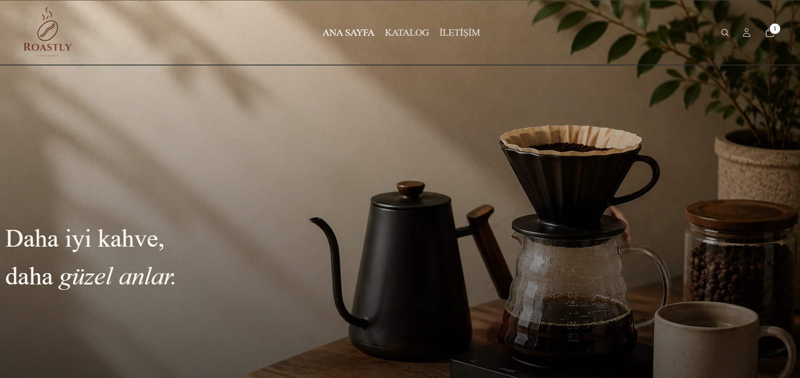
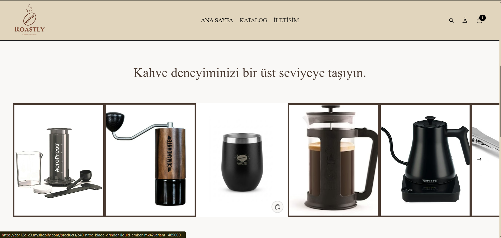
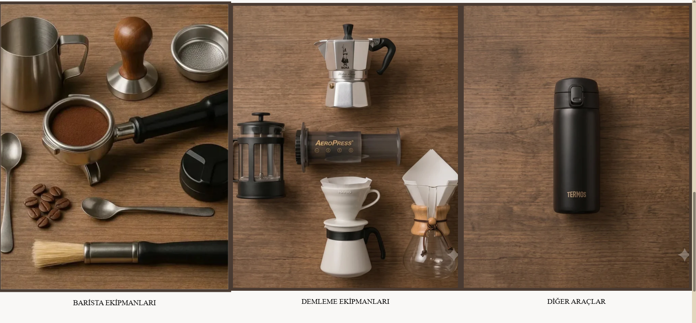
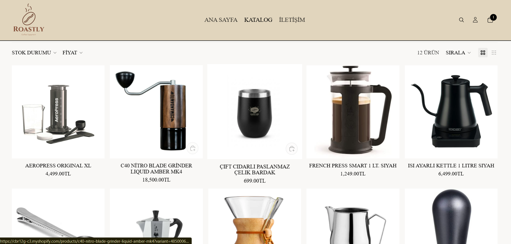

#  Roastly - Premium Coffee Gear Shopify Theme

Roastly, kahve ekipmanları ve barista aksesuarları satışına yönelik geliştirilmiş modern bir Shopify e-ticaret temasıdır. Tema, Shopify'ın Craft teması temel alınarak özelleştirilmiş; kullanıcı deneyimi, sade tasarım anlayışı ve mobil uyumluluk ön planda tutularak geliştirilmiştir.


##  Proje Hakkında

Roastly; kahve severlerin ihtiyaç duyabileceği espresso makineleri, manuel demleme ekipmanları, öğütücüler ve çeşitli kahve aksesuarlarını modern bir arayüz üzerinden sunmayı amaçlayan örnek bir e-ticaret projesidir.

Tema geliştirilirken Shopify Online Store 2.0 mimarisi kullanılmış ve Liquid yapısı üzerinden özelleştirmeler gerçekleştirilmiştir.


##  Tasarım

- **Marka:** Roastly
- **Tema:** Modern ve minimalist
- **Arka Plan Rengi:** `#F9F8F6`
- **Ana Renk:** `#4A3B32`
- **Yardımcı Renk:** `#8C7662`

Tasarım oluşturulurken geniş beyaz alanlar, okunabilir tipografi ve premium bir kullanıcı deneyimi hedeflenmiştir.

##  Proje Yapısı

```
assets/
│── CSS, JavaScript ve görseller

blocks/
│── Tekrar kullanılabilir Liquid blokları

config/
│── Tema ayarları

layout/
│── Ana tema yapısı

locales/
│── Çoklu dil dosyaları

sections/
│── Ana sayfa ve diğer dinamik bölümler

snippets/
│── Ortak kullanılan Liquid bileşenleri

templates/
│── Sayfa şablonları
```


##  Özellikler

- Responsive (Mobil uyumlu) tasarım
- Ajax tabanlı sepet (Cart Drawer)
- Tahmini arama (Predictive Search)
- Shopify Online Store 2.0 desteği
- Dinamik ürün ve koleksiyon sayfaları
- Özelleştirilebilir ana sayfa bölümleri
- Şeffaf logo desteği
- Modern ve kullanıcı dostu arayüz


##  Kullanılan Teknolojiler

- Shopify Liquid
- HTML5
- CSS3
- JavaScript
- JSON
- Shopify Online Store 2.0


##  Kurulum

### Shopify CLI

```bash
shopify login --store your-store.myshopify.com

shopify theme dev
```

### GitHub ile Bağlama

1. Shopify Admin paneline giriş yapın.
2. **Online Store → Themes** bölümünü açın.
3. **Add Theme → Connect from GitHub** seçeneğini seçin.
4. GitHub deponuzu bağlayın.
5. `main` branch'i seçerek temayı kullanmaya başlayın.


##  Ekran Özellikleri

- Ana Sayfa
- Ürün Sayfası
- Koleksiyon Sayfası
- Arama Sayfası
- Sepet Sayfası
- İletişim Sayfası
- Hakkımızda Sayfası

##  Ekran Görüntüleri

### Ana Sayfa






### Ürün Sayfası




### Sepet


### Koleksiyonlar


